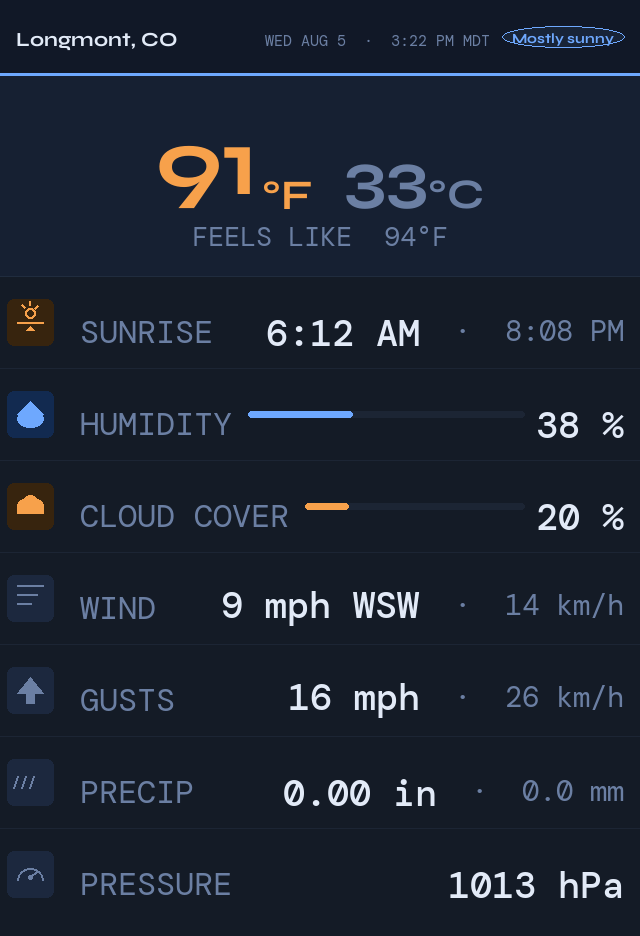
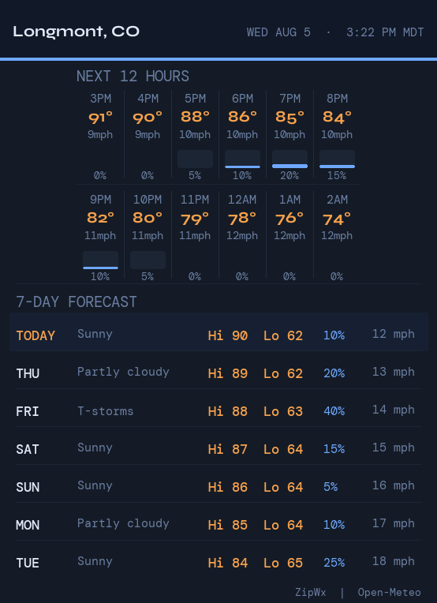
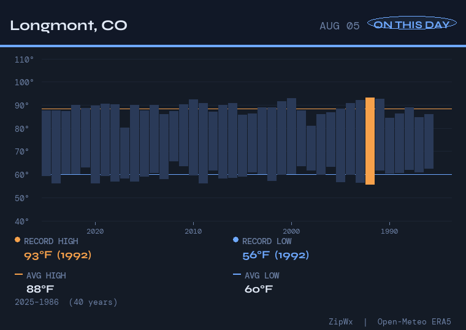
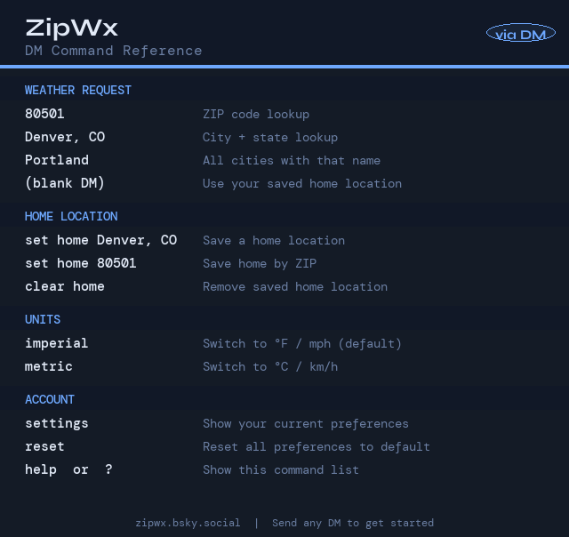

# bluesky-weather-bot @ZipWx

A modular Bluesky bot that responds to weather requests from public posts,
direct messages, and file-based alerts, and can proactively DM you when a
weather condition you care about is met.

This doc has two parts: the **[User's Guide](#users-guide)** covers what the
bot does and how to talk to it; the **[Developer's Guide](#developers-guide)**
covers how it's built, how to run it, and how to deploy it.

---

# User's Guide

## What it does

- **Ask for weather** — mention it publicly, DM it, or drop a file in its
  inbox — and get back an image card or a text thread.
- **Add `/forecast` or `/day`** to a request to get the 12-hour/7-day forecast
  card or the "on this day" historical chart alongside the default current-
  conditions reply.
- **Set weather alarms** over DM in plain English ("alert me if temp hits
  100") and get proactively DMed when the condition is met.
- **Personalize** your home location, display units, and image layout — once
  set, they apply to every future request on any channel.


  Weather data is provided by a https://open-meteo.com/ API. 

## Triggering the bot

| Method | Example |
|--------|---------|
| Public post — mention + zip | `@zipwx.bsky.social 80501` |
| Public post — mention + city | `@zipwx.bsky.social Denver, CO` |
| Public post — mention + city only | `@zipwx.bsky.social Portland` *(returns results for all matches)* |
| Public post — mention anywhere, natural phrasing | `Hey @zipwx.bsky.social, what's the forecast for Minneapolis?` |
| Direct message — zip or city | `80501` or `Denver, CO` or `Portland` |
| Direct message — home location | *(no text needed — uses your saved home location)* |
| File inbox | Drop a YAML file into `inbox/` |

The mention doesn't need to lead the post, and the location doesn't need to
be the text right after it — the whole message is scanned for a zip, a
"City, ST", or a recognized city name.

The bot replies to the original post (public) or sends a DM response. Image
mode is used for public replies; DMs always use the text thread format since
Bluesky DMs do not support image attachments.

## Directives — `/forecast` and `/day`

By default a request gets back just the current-conditions card (or, in text
mode, just the current-conditions post) — this keeps the common case fast.
Add either directive anywhere in your message to opt into more:

| Directive | Adds |
|-----------|------|
| `/forecast` | The 12-hour + 7-day forecast card |
| `/day` | The "on this day" historical temperature chart |

```
@zipwx.bsky.social 80501 /forecast
@zipwx.bsky.social 80501 /forecast /day
```

Both work together and can appear anywhere in the message; the location is
still parsed correctly around them. `/day` in particular is worth opting into
rather than defaulting on — the historical chart is backed by a ~75-year
archive query that's by far the slowest part of building a reply.

## What it looks like

**Image mode** (`POST_MODE=image`) — up to 3 PNG cards, gated by the
directives above:

| Current conditions (default) | + `/forecast` | + `/day` |
|---|---|---|
|  |  |  |

- **Card 1** — current conditions: temp, feels-like, sunrise/sunset,
  humidity, wind, gusts, precip, pressure. Sized for a vertical phone screen.
- **Card 2** (`/forecast`) — 12-hour hourly + 7-day daily forecast
- **Card 3** (`/day`) — "On this day" ERA5 temperature history (~75 years),
  record high/low, averages, with a legend for the highlighted bars

**Text mode** (`POST_MODE=text`) — a post thread (also used for DM replies;
`/forecast`/`/day` have no effect here — DMs always get the full thread):

```
📍 New York, NY | Sat Mar 14 10:15 PM EDT
☀️ Clear sky
🌡 41°F (5°C) | Feels 32°F (-0°C)
💧 Humidity: 41%
💨 Wind: 9mph (14km/h) NNW | Gusts 18mph (29km/h)
🌧 Precip: 0.00in (0.0mm)
📊 Pressure: 1022hPa
---
⏱ Next 6 Hours — New York, NY
10PM: 41°F, ☁ 5%, 💧 0%, 💨 9mph
11PM: 39°F, ☁ 4%, 💧 0%, 💨 7mph
12AM: 37°F, ☁ 50%, 💧 0%, 💨 4mph
1AM: 35°F, ☁ 18%, 💧 0%, 💨 5mph
2AM: 34°F, ☁ 32%, 💧 1%, 💨 4mph
3AM: 34°F, ☁ 100%, 💧 1%, 💨 3mph
---
📅 Historical — New York, NY
Last year (Mar 14, 2025):
  Hi 55°F (13°C) / Lo 33°F (1°C) | Precip 0.00in
10-yr avg (Mar ±7d):
  Hi 57°F (14°C) / Lo 38°F (3°C) | Precip 0.14in
```

## Personalizing via DM

Send commands directly to the bot via Bluesky DM. Changes are stored per-user
and apply to all future responses on any channel.



### Weather requests

Just send a location — no trigger word needed:

```
80501
Denver, CO
Portland
```

If you have a home location saved, send a blank DM and the bot replies with
your home weather automatically.

### Home location

```
set home Denver, CO      ← save by city
set home 80501           ← save by ZIP
clear home                ← remove saved location
```

The bot validates the location before saving. Your home location is also the
fallback location for weather alarms that don't name one explicitly.

### Display units

Both °F and °C (and mph/km/h, in/mm) are always shown. The units setting
controls which appears first.

| Command | Effect |
|---------|--------|
| `imperial` | °F · mph · inches first (default) |
| `metric` | °C · km/h · mm first |

Aliases: `use imperial`, `fahrenheit`, `set units imperial` · `use metric`,
`celsius`, `set units metric`.

### Image layout

Only affects public replies in image mode (DMs are always text).

| Command | Effect |
|---------|--------|
| `phone` | Portrait cards sized for a phone screen (default) |
| `desktop` | Landscape cards sized for a monitor |

Aliases: `mobile`, `portrait` for phone · `laptop`, `wide` for desktop.

### Account commands

| Command | Effect |
|---------|--------|
| `settings` | Show your current units, layout, and home location |
| `reset` | Clear all preferences and return to defaults |
| `help` or `?` | Show the command reference card |

## Weather alarms

Register a plain-English condition over DM, and the bot DMs you the moment
it's next observed true.

```
alert me if temp hits 100
notify me when rain chance over 80%
alert me if wind exceeds 50 mph
alert me if temp in Denver, CO drops below 20
send me a dm if forecast high hits 95
```

**Supported metrics:** current temperature, forecast daily high, forecast
daily low, precipitation probability, wind speed.

**Supported comparisons:** `hits` / `reaches` / `above` / `over` / `exceeds`
/ `or higher` (≥) · `drops below` / `falls below` / `below` / `under` /
`less than` (<) · `drops to` / `falls to` / `or lower` / `or less` /
`at most` (≤).

**Location** is optional in the alarm text — name one explicitly (`in
Denver, CO`, `in 80501`) or it falls back to your saved home location. If
neither is available, the bot asks you to set one.

**Units** are inferred from what you type (`100F`, `38C`, `50mph`) or fall
back to your saved display-units preference.

**Cooldown** between repeat DMs for the same alarm is 4 hours for
current-conditions alarms, 24 hours for forecast alarms (a forecast alarm
only needs to fire once a day). The background checker evaluates all active
alarms every 15 minutes.

Creating an alarm identical to one you already have (same metric, comparison,
threshold, location, and public/private-ness) is rejected with a pointer to
the existing one, rather than silently creating a duplicate that'd
double-fire. A public and private version of the same condition are treated
as distinct alarms, not duplicates of each other.

### Public alarms

Add `publicly` or `with post` to the alarm text and it fires as a public
post that `@mentions` you, instead of a DM:

```
alert me publicly if temp hits 100 in Denver, CO
alert me if wind exceeds 50 mph in 80501 with post
alert me publicly if forecast high hits 100 in Denver, CO
```

That last one combines a forecast alarm with a public notification: it
watches the next 7 days' daily highs (not just right now), and posts
publicly with a mention the first time the forecast shows 100°F or higher
for Denver, CO — checked once a day, like any forecast alarm.

Public alarms **require an explicit location in the text** — they never
fall back to your saved home location, so a fire never broadcasts where you
live to everyone unless you named that location yourself in the alarm.
`list alarms` marks these with `[public]`.

### Managing alarms

```
list alarms                              ← view active alarms, with fire counts
edit alarm 1 to alert if temp hits 90    ← change an existing alarm's condition
delete alarm 1                           ← remove one alarm by number
clear alarms                             ← remove all of your alarms
```

`list alarms` numbers your alarms in the order they were created — that
number is what `edit alarm N` / `delete alarm N` refer to.

---

# Developer's Guide

## Architecture

```
Alert channels (inputs)          Notify channels (outputs)
─────────────────────            ─────────────────────────
FileWatcherAlertChannel    ──┐
FirehoseAlertChannel       ──┤   (MENTION_BACKEND selects
JetstreamAlertChannel      ──┼──▶  ZipWx (orchestrator)  ──▶  BlueskyPostNotifyChannel
DMAlertChannel             ──┘   one/both of these two)  ──▶  BlueskyDMNotifyChannel
                                       │
                                       ▼
                                  WeatherService  ──▶  AlarmChecker (background thread)
                                  (Open-Meteo API, free)      │
                                       ▼                      ▼
                                    Database  ◀────────────────
                                   (SQLite WAL)
```

Every inbound request becomes an `AlertRequest` (channel-agnostic: a public
mention, a DM, and a file-drop all normalize to the same shape) and is
handed to `ZipWx`, which resolves the location, calls `WeatherService`,
formats a reply, and hands it to whichever `NotificationChannel` the source
channel routes to. `AlarmChecker` runs independently on a timer, reusing the
same `WeatherService` and `Database`.

**Adding a new alert channel** (e.g. webhooks):
1. Create `channels/alert/webhook.py` subclassing `AlertChannel`
2. Implement `start()` and `stop()`
3. Register it in `bot.py`'s `build_bot()`

**Adding a new notification channel** (e.g. email):
1. Create `channels/notify/email.py` subclassing `NotificationChannel`
2. Implement `send(payload) → NotificationResult`
3. Register it in `bot.py`'s `build_bot()`
4. Add routing logic in `ZipWx._route()`

## Public-mention backends: Firehose vs. Jetstream

Public `@mention` posts can be picked up two different ways, selected via
`MENTION_BACKEND`:

- **`firehose`** (`firehose.py`) — connects to the raw AT Protocol firehose
  (`com.atproto.sync.subscribeRepos`) and CAR/CBOR-decodes *every* post on
  the entire network, discarding everything that isn't a mention, to find
  the ones that are.
- **`jetstream`** (`jetstream.py`) — connects to Bluesky's
  [Jetstream](https://bsky.network/docs/jetstream) service instead, which
  re-streams the network as pre-filtered, pre-decoded JSON (server-side
  filtered to `app.bsky.feed.post`, so no CAR/CBOR decode happens in this
  process at all).

**Why Jetstream exists:** the original motivation was a Pi 3B running two
bots (this one plus a sibling `snowbot`), each independently firehose-
subscribing and decoding the entire network — a real, measured contributor
to chronic thermal throttling on the Pi (see git history around
2026-08-10). Jetstream does the equivalent filtering upstream, on Bluesky's
infrastructure, instead of in-process.

**Measured comparison** (2026-08-17/18, same Pi 3B, same account):

| | Firehose | Jetstream |
|---|---|---|
| Average CPU | 61.4% (7-day systemd average) | 6.31% (22.6-hour average) |
| Detection latency (same real post, head-to-head) | — | ~35s faster |
| Known instability | Periodic `ConsumerTooSlow` disconnects (handled by a watchdog/reconnect) | Cursor-based resume — a forced reconnect resumes from the last processed event instead of silently skipping ahead |

**Running both at once is safe.** `MENTION_BACKEND=firehose,jetstream`
registers both channels; if they both detect the same post, only one reply
is ever sent — the `requests` table's `UNIQUE` index on `source_uri`
(identical AT-URI format from either channel) makes the second `INSERT` a
silent no-op. This is how the numbers above were gathered: both running
concurrently, comparing real detections of the same live traffic rather
than separate time windows.

**Per-channel observability**, needed because both channels can share one
process (systemd/`top` only give whole-process CPU once that happens):
- `ThreadCPUSampler` (`base.py`) logs each channel's own thread CPU usage
  via `time.thread_time()` every 5 minutes: `[firehose] Thread CPU: 41.8%
  over last 300.0s (125.38s of CPU time)`.
- Every completed request logs one latency line broken down by phase:
  `[bot] Latency channel=jetstream receive=0.45s lookup=0.02s
  delivery=1.81s total=2.25s`. `receive` (post creation → channel
  detection) is the number that actually differs by channel; `lookup`/
  `delivery` are pipeline phases and shouldn't.
- `Database.get_latency_stats(channel="jetstream")` aggregates the same
  data from the DB if you want it programmatically rather than grepping logs.

## Project structure

```
bluesky_weather_bot/
├── main.py                          # entry point
├── bot.py                           # orchestrator (ZipWx + build_bot())
├── requirements.txt
├── .local.env.example               # copy to .local.env
├── weather-bot.service              # example systemd unit (generic placeholders)
│
├── bluesky_weather_bot/
│   ├── alarms/
│   │   ├── models.py                # AlarmRule dataclass, supported metrics/operators
│   │   ├── parser.py                # natural-language alarm text → AlarmRule
│   │   └── checker.py               # AlarmChecker background thread
│   │
│   ├── channels/
│   │   ├── alert/
│   │   │   ├── base.py              # AlertChannel ABC, AlertRequest, extract_directives(), ThreadCPUSampler
│   │   │   ├── mention_parsing.py   # shared trigger/location parsing for firehose.py + jetstream.py
│   │   │   ├── file_watcher.py      # YAML inbox watcher
│   │   │   ├── firehose.py          # Bluesky public post stream (raw AT Protocol firehose)
│   │   │   ├── jetstream.py         # Bluesky public post stream (Jetstream — filtered JSON, lighter)
│   │   │   └── dm_poller.py         # Bluesky Direct Messages
│   │   └── notify/
│   │       ├── base.py              # NotificationChannel ABC + payload/result
│   │       ├── bluesky_post.py      # public reply (image or text thread)
│   │       └── bluesky_dm.py        # direct message reply (text only)
│   │
│   ├── weather/
│   │   ├── models.py                # dataclasses: WeatherReport, CurrentConditions, etc.
│   │   ├── resolver.py              # zip/city → lat/lon + timezone
│   │   ├── client.py                # Open-Meteo API client (no key required)
│   │   ├── formatter.py             # WeatherReport → Bluesky post strings (text mode)
│   │   ├── image_formatter.py       # WeatherReport → PNG image card (image mode)
│   │   └── service.py               # WeatherService facade (single entry point)
│   │
│   ├── storage/
│   │   └── db.py                    # SQLite: weather_cache, requests, responses, alarm_rules, user_prefs
│   │
│   └── config/
│       └── settings.py              # loads .local.env → Settings dataclass
│
├── docs/                            # screenshots and assets
├── tests/                           # pytest suite (mirrors package structure)
├── data/                            # SQLite database (gitignored)
├── inbox/                           # YAML alert files drop here
│   ├── archive/                     # processed files moved here
│   └── errors/                      # unparseable files moved here
└── logs/                            # log files (gitignored)
```

## Local setup

```bash
# 1. Clone and set up environment
git clone https://github.com/jimmoffitt/bluesky-weather-bot.git
cd bluesky-weather-bot
python3 -m venv .venv && source .venv/bin/activate
pip3 install -r requirements.txt

# 2. Configure credentials
cp .local.env.example .local.env
# Edit .local.env — set BSKY_HANDLE, BSKY_APP_PASSWORD, and POST_MODE

# 3. Run (single instance — do not start multiple)
python3 main.py
```

> **Note:** Always ensure only one instance is running against the same
> Bluesky account. Multiple processes each respond to every incoming post,
> resulting in duplicate replies.

### Image mode dependencies

`POST_MODE=image` needs Pillow — already in `requirements.txt` (marked
optional there, but installed by the same `pip3 install -r requirements.txt`
above). If it ends up missing anyway, the bot logs a warning and falls back
to text mode automatically rather than failing to start. `matplotlib` is
also listed in `requirements.txt` but isn't actually imported anywhere in
`image_formatter.py` — every card, including the `/day` chart, is drawn with
plain Pillow.

## Configuration

All settings are loaded from `.local.env` (gitignored). Copy
`.local.env.example` to get started.

| Variable | Default | Description |
|----------|---------|-------------|
| `BSKY_HANDLE` | *(required)* | Your bot's Bluesky handle |
| `BSKY_APP_PASSWORD` | *(required)* | App password from Bluesky settings |
| `POST_MODE` | `text` | `text` — post thread; `image` — up to 3 PNG cards |
| `MENTION_BACKEND` | `firehose` | Comma-delimited list selecting which public-@mention channel(s) run: `firehose`, `jetstream`, or `firehose,jetstream` to run both at once. See [Public-mention backends](#public-mention-backends-firehose-vs-jetstream). |
| `SERVER_TYPE` | `laptop` | Shown in latency footer. `Pi` gets a specific "Raspberry Pi running in a basement" phrasing; any other value is shown verbatim as "a {value}." |
| `SKIP_HISTORICAL` | `false` | Skip the year-ago/10-yr-avg archive call — faster, useful during development |
| `WEATHER_CACHE_TTL_MINUTES` | `30` | How long to cache current conditions lookups |
| `DB_PATH` | `data/zipwx.db` | SQLite database path — point to USB drive on Pi for better I/O |
| `INBOX_PATH` | `inbox` | Directory watched for YAML alert files |
| `INBOX_ARCHIVE_PATH` | `inbox/archive` | Processed YAML files moved here |
| `INBOX_ERROR_PATH` | `inbox/errors` | Unparseable YAML files moved here |
| `INBOX_POLL_INTERVAL_SEC` | `5.0` | How often to check the inbox directory |
| `LOG_PATH` | `logs/zipwx.log` | Log file path |
| `LOG_LEVEL` | `INFO` | `DEBUG` / `INFO` / `WARNING` / `ERROR` |

## Testing

```bash
# Unit tests only (no network, no credentials) — the normal day-to-day run
.venv/bin/python3 -m pytest -m "not integration and not live"

# Include integration tests (hits live Open-Meteo, no Bluesky credentials needed)
.venv/bin/python3 -m pytest -m "not live"

# Everything, including tests that send real Bluesky posts/DMs
# (needs BSKY_HANDLE + BSKY_APP_PASSWORD in .local.env)
.venv/bin/python3 -m pytest
```

The suite mirrors the package layout (`tests/test_alarms/`,
`tests/test_channels/`, `tests/test_weather/`, plus `tests/test_bot.py` for
`bot.py`'s pure helper functions). Image-formatter tests are skipped
automatically if Pillow or matplotlib aren't importable (the test file
guards on both, even though only Pillow is actually used by the code under
test).

## Weather data

Powered by [Open-Meteo](https://open-meteo.com/) — free, no API key required.

- **Current**: temp, feels-like, humidity, wind, gusts, cloud cover,
  pressure, visibility, sunrise/sunset
- **Forecast**: next 12 hours hourly + 7-day daily (temp, precip
  probability, wind, cloud cover) — same API call as current conditions, so
  the `/forecast` directive costs nothing extra to fetch, only to render
- **Historical comparison**: same date last year + 10-year climatological
  average (used by the text-mode thread's third post). Fetched on every
  cache-miss lookup unless `SKIP_HISTORICAL=true`
- **On this day**: ERA5 reanalysis — ~75 years of daily high/low for the
  current date, record high/low, averages. This is its own, separately
  cached archive query (`this_day_history_cache` table, keyed by location +
  month/day) and is only fetched when a request includes `/day` — it's by
  far the slowest single call in the whole pipeline (a full historical range
  query), which is why it isn't fetched by default.

All values shown in dual units (°F/°C, mph/km/h, in/mm). Display order is
user-configurable via DM — see [Display units](#display-units).

## Inbox YAML format

```yaml
full_message: 'Red Rocks Park 30-day rain total: 0.71 inches #RainData #COWx'
message: 'Red Rocks Park 30-day rain total: 0.71 inches'
created_at: '2025-02-19T17:30:07+07:00'
host: Test
tags:
  - COWx
  - Rain
mentions:
```

## Deploying on a Raspberry Pi

The bot runs well on a Pi as an always-on `systemd` service — this is the
reference deployment.

### 1. Clone and set up

```bash
cd ~/projects
git clone https://github.com/jimmoffitt/bluesky-weather-bot.git
cd bluesky-weather-bot
python3 -m venv venv && source venv/bin/activate
pip3 install -r requirements.txt   # Pillow for image mode is already in here
cp .local.env.example .local.env
# edit .local.env: BSKY_HANDLE, BSKY_APP_PASSWORD, POST_MODE=image, SERVER_TYPE=Pi
```

### 2. Install the systemd unit

`weather-bot.service` is checked into the repo as a **generic example** —
`User=pi`, `WorkingDirectory=/home/projects/bluesky_weather_bot`. Copy it and
substitute your actual username and clone path (a real deployment's paths
are personal to that machine and intentionally aren't hardcoded into the
tracked file):

```bash
sudo cp weather-bot.service /etc/systemd/system/weather-bot.service
sudo nano /etc/systemd/system/weather-bot.service   # fix User= and the three paths
sudo systemctl daemon-reload
sudo systemctl enable --now weather-bot
```

> **Important:** `ExecStart` must point at the venv's `python` directly (not
> the system Python) so all dependencies are available.

### 3. Operating it

```bash
sudo systemctl status weather-bot
sudo journalctl -u weather-bot -f       # follow live logs
sudo journalctl -u weather-bot -n 100   # last 100 lines

sudo systemctl restart weather-bot
sudo systemctl stop weather-bot
```

### 4. Deploying updates

The Pi is just a git clone — ship a change by pushing to `main` and pulling
on the Pi, then restarting:

```bash
git pull --ff-only origin main
sudo systemctl restart weather-bot
```

Restarting typically takes 25-45 seconds to reach "running" (Bluesky auth +
DM backlog catch-up) — check `journalctl -u weather-bot -f` for the
`ZipWx running.` line rather than judging it dead from a `systemctl status`
that lands mid-startup.

### Operational notes specific to running on a Pi

- **The firehose connection can silently wedge.** The public firehose
  (`FirehoseAlertChannel`) occasionally hits a `ConsumerTooSlow` disconnect
  from Bluesky's relay; a watchdog thread force-reconnects if no traffic is
  seen for 45s, and escalates to killing the whole process (letting
  `Restart=on-failure` bring it back clean) if that reconnect doesn't
  actually restore traffic within one more check. This is a known rough edge
  in how the connection recovers, not something you need to intervene in —
  but if public replies stop working, a `sudo systemctl restart weather-bot`
  is always a safe first move. `JetstreamAlertChannel` has the same
  watchdog/escalation pattern but hasn't been observed hitting it in
  practice — see [Public-mention backends](#public-mention-backends-firehose-vs-jetstream).
- **All `Database` access is serialized with a lock**, needed because every
  alert channel runs on its own thread and they all share one
  `sqlite3.Connection` — `check_same_thread=False` only disables Python's
  own thread-affinity check, it does not make concurrent access from
  multiple threads safe on its own. This was a real bug (not hypothetical):
  running `firehose,jetstream` together, both channels detecting the same
  post milliseconds apart reliably corrupted the connection's transaction
  state and silently dropped the request. Fixed with a `threading.RLock()`
  around every `Database` method — if you add a new method that touches
  `self._conn`, decorate it with `@_locked` too.
- **`.local.env` is gitignored and never committed** — confirmed clean across
  this repo's entire history. Verify on any new clone with
  `git log --all -- .local.env` (should print nothing).
- **WAL-mode SQLite tolerates the abrupt restarts above fine** — no special
  shutdown handling needed.
